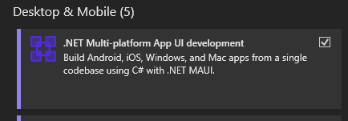

# Server Backend

## How to Setup

### 1. Prerequisites

* [Server-backend running locally](https://github.com/Northwood-HS-SST/server-backend)
* .NET-Capable IDE
  * [Visual Studio (2026 preferrably)]()
  * [JetBrains Rider]()
  

### 2. Setup

* Clone the Repository

    Open Command Prompt, and run these commands.

    ```bash
    git clone https://github.com/Northwood-HS-SST/samsung-solve.git
    cd samsung-solve
    ```

*  Install Dependencies

    #### Visual Studio Specific Instructions

    1. Open the **Visual Studio Installer**
    2. Click the `Modify` button on the right of your Visual Studio installation
    3. Check the box seen below
        
    4. Click Install While Downloading on the bottom right and wait for your installation to finish

    #### JetBrains Rider Specific Instructions

    1. Open the `New Solution` menu, but DO NOT make a new solution
    2. Click the `MAUI` button on the left
    3. Make sure the Target Framework is set to .NET 10.0
    4. Click `Install .NET MAUI` if present, and wait for your installation to finish

    [For information on how to test mobile deployments in JetBrains Rider, see the website.](https://www.jetbrains.com/guide/dotnet/tutorials/maui-development/install-maui/)

### 3. Usage

Usage is simple, but the server backend MUST be running if you are attempting to interact with the API endpoints.

